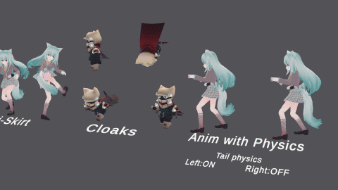

# IzBone  ---WIP---
Simple bone modules for Unity

ボーンを使用したシンプルな共通モジュールをまとめたライブラリ。まだ途中です。
WebPlayerを含む全プラットフォームに対応(しているはず)

- 揺れもの物理シミュレーション

  - 揺れものをシミュレーションするための機能です
  - スカートを突き抜けずにシミュレーション可能
  - マント・ケモ耳・しっぽ・おっぱい・髪の毛・揺れもの系アクセサリーなどが表現可能
  - 縦/横方向の接続、ねじれ、曲げなどに対しても復元力を設定できます
  - しっぽなど、アニメーションしつつ物理を適応したいケースにも対応
  - しっぽやケモ耳などの単純な形状に対しては、シンプルでより破綻しにくい軽量モジュールがあります

## TODO

* ドキュメントをまとめる
* PhysSpringに重力/風の影響を追加
* PhysSpringのボーン設定をPhysClothに合わせる
* PhysCloth/PhysSpringのインスペクタを改善
* インスペクタを日/英対応
* ECS部分のヒープアロケーションを何とかする
* 風の影響を簡単に設定するためのモジュールを追加
* 表情用モジュールを追加
* PackageManagerに対応

# License
- [License](LICENSE)

